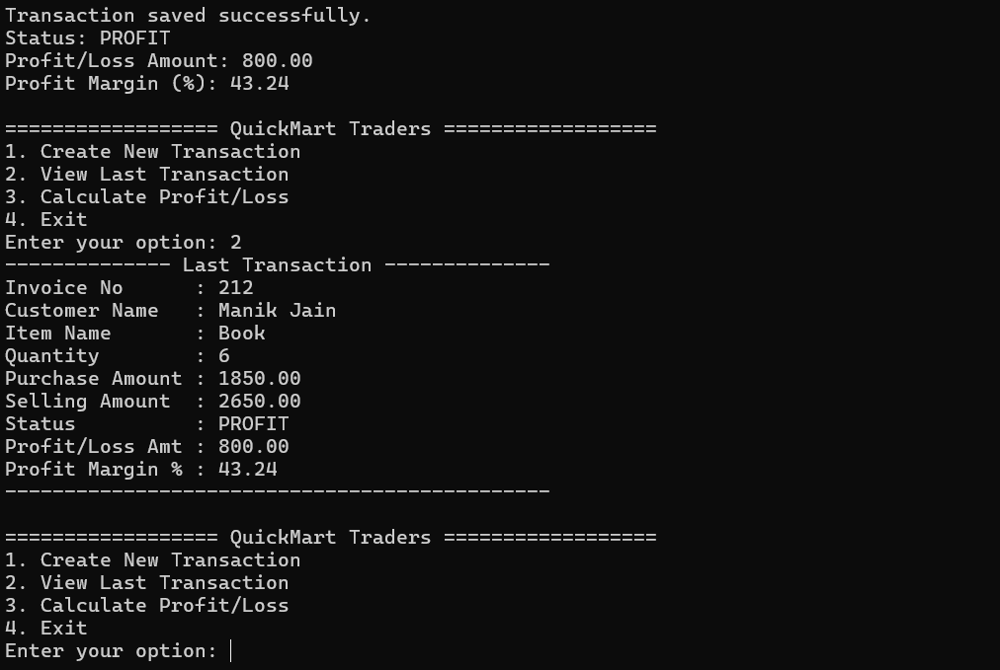
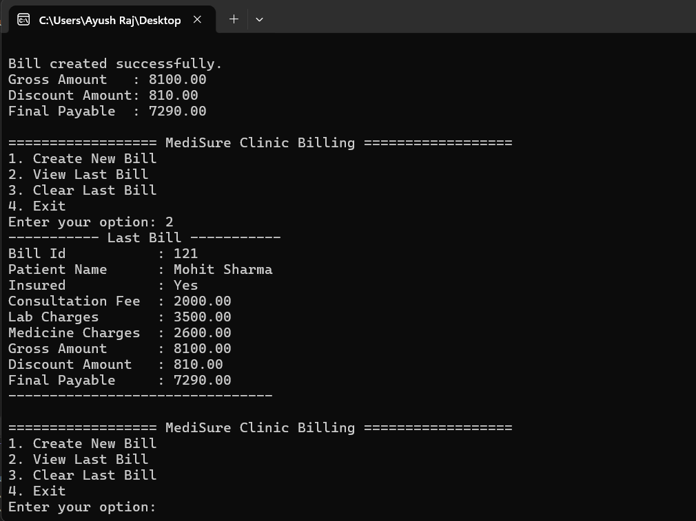

# DOTNET Weekly Test – Console Applications

This repository contains **two C# Console Applications** developed as part of a **.NET Weekly Evaluation**.  
Both applications are **menu-driven**, follow **OOP principles**, and strictly follow the given constraints.

---

## 📌 Projects Included

### 1️⃣ QuickMart Profit Calculator
A console-based application to calculate **Profit / Loss / Break-Even** for a retail sales transaction.

### 2️⃣ MediSure Clinic Billing System
A console-based billing application to calculate the **final payable amount** for clinic patients with optional insurance discount.

---

## 🛠️ Tech Stack & Concepts Used
- Language: **C#**
- Framework: **.NET Console Application**
- IDE: **Visual Studio Code**
- Concepts:
  - Classes & Objects (OOP)
  - Properties (`get` / `set`)
  - If-Else & Switch Case
  - Static variables (single record storage)
  - Console Input / Output
  - Input Validation

---

---

## ▶️ How to Run

### Run QuickMart_Profit_Calculato
cd QuickMart_Profit_Calculato   
dotnet run
### Run MediSure_Clinic_Billing
cd MediSure_Clinic_Billing  
dotnet run

## 📊 Output Screenshots

### ✅ QuickMart Profit Calculator – Output

### ✅ MediSure Clinic Billing System – Output

